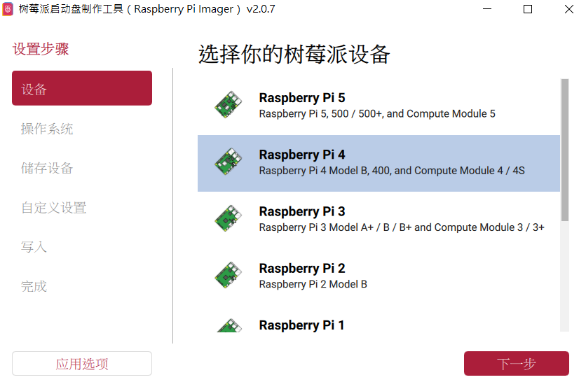
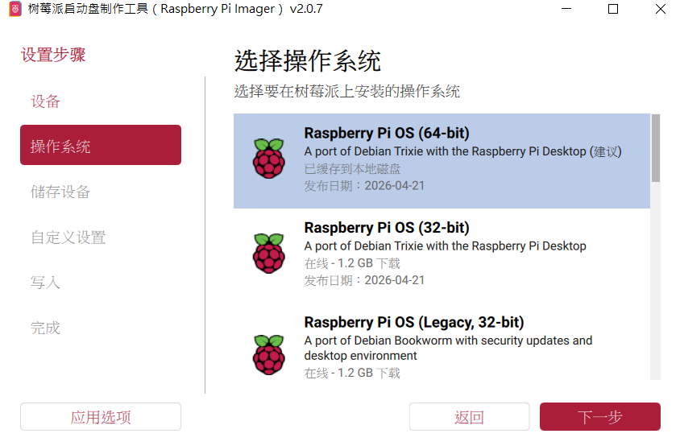
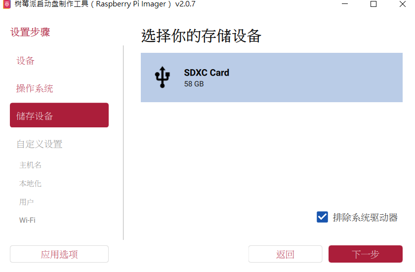
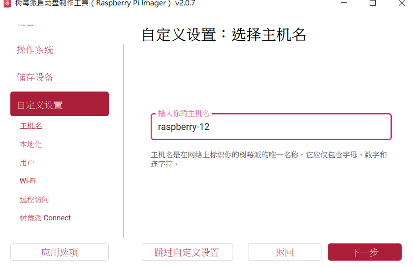
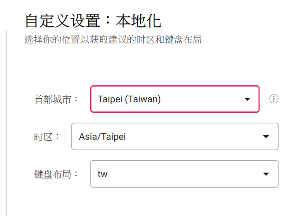
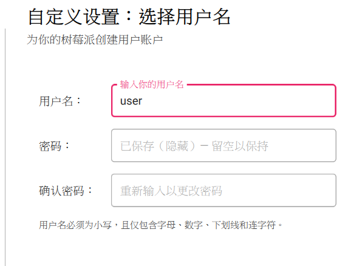
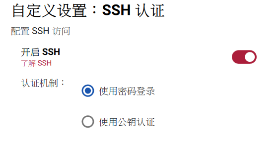
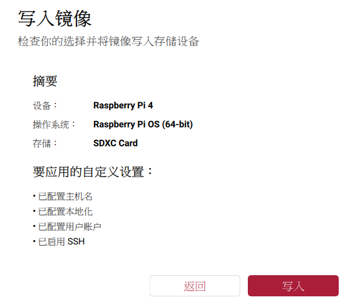

## 刷機

https://www.raspberrypi.com/software/

1.	下載 Raspberry Pi Imager
    
2.	選擇 Raspberry Pi 4 64-bit
    
3.	插上讀卡機
    
4.	輸入主機名，ssh 會用到
    
5.	首都 Taipei ;時區Asia/Taipei
    
6.	輸入用戶名及密碼，ssh 會用到
    
7.	開啟 ssh
    
8.	完成寫入
    

---

## 環境安裝

### 1. 安裝 Python 套件

```bash
# 安裝 demo（推論 + 攝影機）所需套件
pip install -r demo/requirements.txt

# 安裝訓練所需套件（若需重新訓練模型）
pip install -r train/requirements.txt
```

### 2. 套件清單

| 套件 | 用途 |
|------|------|
| `opencv-python` | 攝影機擷取與影像處理 |
| `numpy` | 數值運算 |
| `ultralytics` | YOLOv8 模型訓練與推論 |
| `torch` / `torchvision` | 深度學習框架（YOLO 底層） |
| `scikit-learn` | SVM 模型（備援） |
| `joblib` | SVM 模型載入 |

---

## 運行方式

### 即時攝影機辨識 — `rps_camera.py`

開啟攝影機，即時辨識手勢為剪刀、石頭或布。

```bash
cd demo
python rps_camera.py
```

**操作說明：**

| 按鍵 | 功能 |
|------|------|
| `空白鍵` | 擷取畫面並辨識手勢 |
| `Q` | 離開程式 |

**執行流程：**
1. 程式自動搜尋可用模型（優先 YOLO，備援 SVM）
2. 自動搜尋可用攝影機（依序嘗試 DirectShow → MSMF → 自動偵測）
3. 顯示即時畫面，畫面中央有綠色 ROI 框
4. 將手放入框中，按空白鍵辨識
5. 辨識結果（含信心分數）顯示在畫面底部

**模型優先順序：**
- `rps_yolo_model.pt`（YOLOv8 分類模型）→ 準確率高，附帶信心分數
- `rps_svm_model.pkl`（SVM 模型）→ 備援，無需 GPU

> ⚠️ 若攝影機無法開啟，請在「裝置管理員」中確認攝影機驅動是否正常。

---

### 測試模型準確率 — `test.py` / `test_yolo.py`

在測試集上評估模型準確率。

#### YOLO 模型測試

```bash
cd demo
python test_yolo.py
```

**輸出內容：**
- 整體準確率
- 各類別（Rock / Paper / Scissors）準確率
- 混淆矩陣

#### SVM 模型測試

```bash
cd demo
python test.py
```

**輸出內容：**
- 整體準確率
- 分類詳細報告（precision / recall / F1-score）

---

### 重新訓練模型

#### 訓練 YOLO 模型

```bash
cd RSP_demo-main
python train/train_yolo.py
```

- 使用 `yolov8n-cls` 預訓練權重
- 訓練參數：epochs=50, imgsz=224, batch=32
- 支援 CPU 訓練（約 10~30 分鐘）
- 訓練完成後自動將最佳模型複製到 `demo/rps_yolo_model.pt`

#### 訓練 SVM 模型

```bash
cd RSP_demo-main
python train/train_svm.py
```

---

## 專案結構

```
RSP_demo-main/
├── dataset/
│   ├── train/          # 訓練集（rock/paper/scissors 各 840 張）
│   ├── test/           # 測試集（rock/paper/scissors 各 124 張）
│   └── validation/     # 驗證集
├── demo/
│   ├── rps_camera.py   # 攝影機即時辨識程式
│   ├── test.py         # SVM 模型測試
│   ├── test_yolo.py    # YOLO 模型測試
│   ├── rps_yolo_model.pt   # YOLO 模型權重
│   ├── rps_svm_model.pkl   # SVM 模型權重
│   └── requirements.txt
├── train/
│   ├── train_yolo.py   # YOLO 訓練腳本
│   ├── train_svm.py    # SVM 訓練腳本
│   └── requirements.txt
└── README.md
```

---

## 模型比較

| 項目 | SVM | YOLOv8n-cls |
|------|-----|-------------|
| 測試準確率 | — | **94.89%** |
| 模型大小 | 27 MB | **2.8 MB** |
| 推論方式 | 灰階 64×64 攤平 | 彩色 224×224 CNN |
| 信心分數 | ❌ | ✅ |
| 需要 GPU | ❌ | ❌（CPU 可推論） |

---

## 評分標準

- 成功在 Raspberry Pi 4 上執行 手勢辨識 50%
- Demo 展示影片(carema) 15%
    - 15 個手勢 (各5)
- 報告 35%
	- 需自行找兩個模型架構修改 20%
		- 至少需呈現 accuracy, precision, recall, F1-score
	- 需解釋更換模型原因及比較差異 15%
